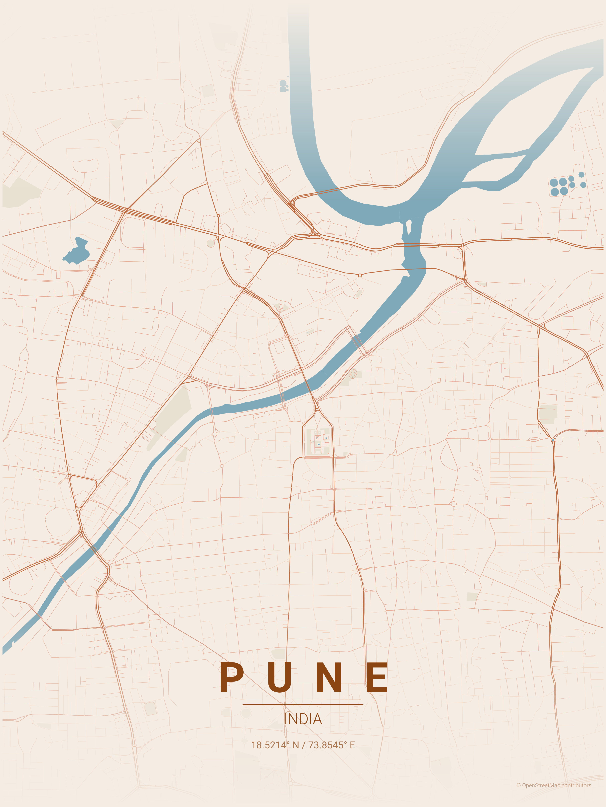

# AI Poster Studio

[](https://deepwiki.com/kawas8516/maptoposter)


Turn any city into a clean, minimalist map poster. Pick from 17 built-in
themes, or upload a photo and let the app build a matching color palette from
it. Every palette — generated or hand-picked — is automatically checked for
readability before you see the result.

A fork of [maptoposter](https://github.com/originalankur/maptoposter) by Ankur
Gupta. The map-rendering engine is upstream's and is **unmodified**; this fork
adds an AI theming layer on top of it.

There's also a description-to-theme pipeline you can drive from the command
line (not currently wired into the app's UI — see [Run](#run) below) that
turns a sentence like this into a full color theme:

```
"a moody, rain-soaked Tokyo at night with gold roads"
        │
        ▼
   hosted LLM  ──►  validate  ──►  legibility guards  ──►  maptoposter  ──►  poster
                   (pydantic)      (WCAG + CIEDE2000)      (unchanged)
```

| | |
|---|---|
|  |  |

---

## In my own words

I forked an existing open-source map poster generator and built an AI layer on top of it. The core idea: instead of picking from a fixed list of 17 color themes, you can also describe a mood in plain English (currently via the CLI — see [Without the UI](#without-the-ui)), or upload a photo through the app, and it generates a matching theme for you.

The interesting engineering problem was: AI output can't be trusted blindly. So every theme — however it's generated — gets validated against a strict schema before it touches any file path or network call, and then checked against two accessibility rules: WCAG contrast, so the text is actually readable, and a color-distance formula called CIEDE2000, so different road types don't blur into each other. If a generated palette fails either check, the app automatically nudges the color until it passes, instead of just shipping something illegible.

For the photo feature, I used K-Means clustering to pull out a photo's dominant colors, and CLIP to classify its overall mood — warm, cool, dark, that kind of thing — and wrote the rules that map those into a poster theme.

I also built an evaluation harness that runs a batch of prompts through the pipeline and measures how often it succeeds, how often it needs a retry, and how fast it is — so I have actual numbers backing up "it works," not just a demo that happened to work once (see [EVALUATION_REPORT.md](EVALUATION_REPORT.md)). And I wrote 210 automated tests, including checking my color-math implementation against published reference values from a real color-science paper, since I didn't want to just trust that I'd implemented the formula right.

## Why

maptoposter ships 17 hand-written theme files. They look great, but they're a
fixed catalogue — you can't ask for a new mood, and nothing stops a hand-edited
palette from becoming hard to read. This fork adds a theme generator on top of
that catalogue, plus a safety net that applies to every theme, generated or
not.

**Model output is never trusted blindly.** A hosted LLM's response is parsed,
checked against a strict schema (unknown fields are rejected), and
range-checked before it can touch a file path or a network request. That means
a model can't sneak in extra render parameters, write outside the output
folder, or trick the app into requesting a huge map.

**Legibility is checked, not assumed.** Every palette — generated, stock, or
pulled from a photo — is measured against two plain rules: **WCAG contrast**
(is the text readable against the background?) and **CIEDE2000 color
difference** (a perceptual color-distance metric — basically, "are these two
colors different enough for a human to tell apart at a glance?"). A palette
that fails either check gets nudged back into range automatically, and you're
shown exactly what changed rather than having it happen silently. See
[The guards](#the-guards) for the details.

## Install

Requires Python 3.11+.

```bash
python -m venv .venv
source .venv/bin/activate          # Windows: .venv\Scripts\activate
pip install -r requirements.txt
```

Optional — set a Hugging Face token if you want to use the description-to-theme
CLI script (`scripts/try_describe.py`) or run the evaluation harness:

```bash
export HF_TOKEN=hf_...             # or `huggingface-cli login`
```

The token is read from `HF_TOKEN`, then `.streamlit/secrets.toml`, then your
cached CLI login. This project never writes it to disk or logs it. Without a
token, the description pipeline still works — it just falls back to the
closest stock theme instead of calling the model.

The **Match a Photo** tab pulls in `scikit-learn`, `transformers`, and `torch`
(already pinned in `requirements.txt`). The first time you use it, it
downloads CLIP's model weights (~600 MB) to your Hugging Face cache.
Everything runs on CPU — no GPU needed. (The one part of this project that
does want a GPU is the Gallery tab's notebook, and that runs on Colab, not on
your machine — see [ControlNet stretch phase](#controlnet-stretch-phase).)

## Run

```bash
streamlit run app.py
```

The app has three tabs:

**Classic** — pick from the 17 built-in themes, preview their color swatches,
and choose a distance preset (3/5/10/15 km). A stock theme renders exactly as
its author designed it; the legibility guards only kick in if you edit a
color.

**Customize colors** — on any tab, expand this panel to adjust any of the nine
independent colors by hand. Edited palettes go through the same guards as
generated ones, and re-rendering reuses the map data already downloaded, so it
only costs drawing time. Two colors (`gradient_color`, `road_default`) are
derived automatically from the others, so there's no picker for them.

**Match a Photo** — upload a photo instead of picking a theme. Here's the
pipeline: K-Means clustering (k=6) pulls out the photo's dominant colors in
CIELAB color space (used instead of plain RGB because it matches human color
perception more closely), CLIP classifies the photo's overall mood zero-shot
(warm/cool/dark/pastel/vivid), and a documented rule set maps the extracted
colors onto poster roles — lightest/darkest become background/text (flipped
for a "dark" mood, so a genuinely dark photo doesn't get forced into a light
poster), water and parks are matched by color to blue/green, and the
remaining road tiers are built as an even lightness ramp between what's left.
The result goes through the same legibility guards as every other theme
source. See `aiposter/photo.py` for the full rule set with explanations.

**Gallery** — read-only. Shows any `{city}_{style}_{hash}.png` files found in
`gallery/`, grouped by city, or a friendly "nothing here yet" message if the
folder is empty. Nothing on this tab runs a model or needs a GPU — the images
are generated offline by a Colab notebook and copied in afterward. See
[ControlNet stretch phase](#controlnet-stretch-phase).

> **Note:** there used to be a fourth tab, **Describe** (type a mood, get an
> AI-generated theme). It's currently removed from the UI, but the pipeline
> behind it is still here and works from the command line — see
> [Without the UI](#without-the-ui) below, and
> [Generation always returns something](#generation-always-returns-something)
> for how it works under the hood.

### Without the UI

This is currently the only way to reach the description-to-theme pipeline
directly, since there's no Describe tab in the app right now:

```bash
# generate a theme and inspect it, no rendering
python scripts/try_describe.py "a foggy northern harbour at dawn"

# generate and render in one pass
python scripts/try_describe.py "warm monsoon evening" --render --city Pune --country India

# render any theme JSON
python scripts/render_theme.py scripts/rainy_night_tokyo.json \
    --city Tokyo --country Japan -d 10000

# derive a theme from a photo and inspect it (exercises the real CLIP model)
python scripts/try_photo.py path/to/photo.jpg --city Tokyo --country Japan

# warm the OSM cache for the 10 showcase cities (offline demo mode)
python scripts/precache_showcase.py

# evaluation harness: validity, repair, guard and latency rates -> CSV
# (30 prompts today; see "Evaluation harness" below for the PRD's ~100 target)
python scripts/evaluate.py --limit 20
```

> The evaluation harness paces itself (`--delay`, default 3 s). Free-tier
> inference rate-limits a rapid burst, and a throttled request is
> indistinguishable in the aggregate from a model that cannot produce valid
> JSON — so an unpaced run reports a validity figure that is really a quota
> figure. The summary separates transport failures from schema failures for the
> same reason.

The original CLI is untouched and still works — see
[docs/UPSTREAM_README.md](docs/UPSTREAM_README.md):

```bash
python create_map_poster.py --city Paris --country France --theme noir
```

## How the theming layer works

If you want to dig into the code, here's what lives where:

| Module | Role |
|---|---|
| `aiposter/spec.py` | `PosterSpec` / `ThemeSpec` — the pydantic contract model output must satisfy |
| `aiposter/prompts.py` | System prompt, embedded JSON Schema, three few-shot examples |
| `aiposter/llm.py` | Hugging Face client, repair round-trip, model and heuristic fallbacks |
| `aiposter/guards.py` | sRGB↔CIELAB, WCAG contrast, CIEDE2000, auto-correction |
| `aiposter/fallback.py` | Offline keyword → nearest stock theme |
| `aiposter/photo.py` | K-Means (LAB) palette extraction, CLIP zero-shot mood, lightness-ordered role assignment (Match a Photo) |
| `aiposter/render.py` | Theme injection into the upstream engine; safe output paths |
| `aiposter/themes.py` | Registry of the 17 stock themes; colour-edit merging |
| `aiposter/pipeline.py` | Orchestration: concurrency, guards, staged rendering |
| `aiposter/llm_cache.py` | Disk cache of model responses, keyed by normalised prompt |
| `aiposter/timing.py` | Per-stage timing instrumentation |

### Generation always returns something

This is how the description-to-theme pipeline (used by
`scripts/try_describe.py` and the evaluation harness) tries to always produce
something usable, even when a model call fails:

1. Ask `Qwen/Qwen2.5-7B-Instruct`.
2. If the JSON fails validation, **one** repair round-trip carrying the
   validation error back to the model.
3. If that fails, the same two steps against `Qwen/Qwen2.5-72B-Instruct`.
4. If that fails, an offline keyword match to the nearest stock theme.

The repair message contains the validator's complaint and nothing else — no
stack traces, no file paths, no environment details.

`meta-llama/Llama-3.1-8B-Instruct` is deliberately not used: it's gated behind
manual licence approval, so calls fail until a human approves access.

### Photo-to-theme pipeline

1. K-Means (k=6) over the photo's pixels in CIELAB space — perceptual
   clusters, not raw RGB — via `aiposter/guards.py`'s existing `srgb_to_lab`/
   `lab_to_srgb_hex`, so there's one color-math implementation, not two.
2. CLIP (`openai/clip-vit-base-patch32`) zero-shot mood classification over
   five caption-phrased prompts: warm, cool, dark, pastel, vivid.
3. Clusters are assigned to the nine independent theme fields by lightness
   order and CIELAB hue match, with the mood breaking ties between clusters
   that are close in lightness (see the Match a Photo description above for
   the exact rules).
4. The result is guarded and rendered through the identical path every other
   theme source uses — Classic edits and Match a Photo both converge on the
   same `apply_palette_guards` call before a poster is drawn (and so does the
   description pipeline, when used from the CLI).

### The guards

| Check | Threshold | Rationale |
|---|---|---|
| WCAG contrast, `text` vs `bg` | ≥ 4.5:1 | One text colour serves the ~60pt city name *and* the 14pt coordinates and 8pt attribution, so the AA-normal bar is the honest one |
| CIEDE2000, adjacent road tiers | ≥ 10 | Keeps a motorway distinguishable from a primary road at poster scale |

When contrast fails, the **text** colour moves, never the background — the
background is where the aesthetic intent lives. The correction binary-searches
lightness (L\*) for the smallest change that passes, so hue and saturation
survive.

When two road tiers are too close, the lower-priority tier is pushed along the
ramp's lightness direction. `road_default` is excluded from the check because
it duplicates another tier by convention in all 17 stock themes.

Both thresholds live in `GuardConfig` and can be changed in one place.

> **Worth knowing:** at ΔE ≥ 10, only 3 of the 17 stock themes would pass road
> separation, and `sunset` fails contrast at 3.94:1. Generated themes are held
> to a stricter bar than the shipped catalogue. That's a defensible choice —
> hand-tuned designs earn latitude an automated palette hasn't — but if you
> want parity with existing practice, lower `min_delta_e` to about 6.

The color math is implemented directly rather than pulled from a library:
`colormath` is unmaintained and broken on numpy 2.x. The CIEDE2000
implementation is verified against 29 published reference pairs from Sharma,
Wu & Dalal (2005), including the arctangent-discontinuity cases that break
naive implementations.

## Performance

Every generation records per-stage timings — `llm_ms`, `validate_ms`,
`palette_ms`, `mood_ms`, `guard_ms`, `geocode_ms`, `graph_ms`, `render_ms` —
surfaced in a "Performance" expander in the UI and written to the evaluation
CSV. A single end-to-end number can't tell you whether a slow run was the
model, the geocoder, the OSM download, or matplotlib; these can.

Three things keep the common path quick:

- **Overlapping** — when the city is known up front, the OSM download runs on
  a second thread while the model is still thinking. When it's not known,
  there's genuinely nothing to prefetch, and the pipeline says so rather than
  pretending otherwise.
- **Response caching** — repeated descriptions are served from disk, keyed by
  a hash of the normalised prompt plus the model id and prompt version, so
  editing the prompt or switching models never serves a stale answer.
- **Fetch/draw separation** — map data is fetched explicitly before drawing,
  so a color edit re-renders from cache with no network at all. Measured on a
  cached city, a re-render after a color tweak costs ~4 s, almost all of it
  matplotlib.

## Offline demo mode

`scripts/precache_showcase.py` warms the OSM cache (geocode + road graph +
water/parks features) for 10 recognizable, geographically diverse cities —
Tokyo, Paris, New York, London, Pune, Venice, Barcelona, Dubai, Singapore,
Cairo — at the Classic tab's default 3km radius, using the same
`aiposter.render.prefetch` the app itself calls, so there's no separate fetch
logic to keep in sync. Once warm, only the description pipeline's LLM call
(reachable via the CLI, see [Without the UI](#without-the-ui)) needs internet
— Classic, Match a Photo (aside from CLIP's one-time weight download), and
Gallery all work fully offline.

It's idempotent (`render.is_cached` skips anything already warm), so
re-running before a demo costs nothing if the cache is already populated.

```bash
python scripts/precache_showcase.py
```

## Evaluation harness

`scripts/evaluate.py` (FR5.1) runs a fixed prompt set through the
description-to-theme pipeline and writes one CSV row per prompt —
`first_attempt_valid`, `repair_attempted`/`repair_succeeded`, `backup_used`,
`fallback_used`, `guard_passed`/`guard_violations`/`guard_corrections`, and
the full per-stage latency breakdown plus wall-clock time — then prints
validity, repair, guard, and latency rates against the PRD's §7 targets.

`PROMPTS` currently has 30 entries — moods, named and unnamed cities, explicit
named-color requests ("crimson rooftops and gold domes"), and a few
deliberately vague ones to probe the failure paths. The PRD's target is
~100; getting there is the main remaining item on the roadmap below.

It paces itself (`--delay`, default 3 s) because free-tier inference
rate-limits a rapid burst, and a throttled request is indistinguishable in
the aggregate from a model that cannot produce valid JSON — an unpaced run
reports a validity figure that's really a quota figure. The summary
separates transport failures from schema failures for the same reason.

```bash
python scripts/evaluate.py --limit 30
python scripts/evaluate.py --limit 30 --delay 8   # slower, cleaner latency numbers
```

**Latest run** (`runs/eval_20260801_194720.csv`, 30 prompts, default 3s delay):

| Metric | Result | Target |
|---|---|---|
| Posters delivered | 30/30 (100%) | 100% |
| Schema validity, first attempt* | 14/14 (100%) | ≥80% |
| Schema validity, after repair* | 14/14 (100%) | ≥95% |
| Guards passed | 30/30 (100%) | 100% |
| Guards triggered a correction | 23/30 (77%) | — |
| Latency p50 | 5.69 s | ≤15 s |
| Latency p95 | 31.23 s** | ≤30 s |

\* Computed over the 14/30 prompts that reached the model cleanly — 16/30 hit
a free-tier rate limit (a transport failure, not a schema failure, and
excluded from validity math for that reason).

\*\* Confounded by that same rate limiting — one prompt took 2194 s stuck in a
retry/backoff loop, and several others cluster at almost exactly 31 s,
consistent with a fixed internal retry-wait before eventual success rather
than organic pipeline latency. Pipeline correctness held (100% delivery, 100%
validity on reachable prompts, guards working as designed); the latency
figures need a re-run with a larger `--delay` to be trustworthy. This is a
point-in-time result, not a permanent claim — re-running produces a new CSV
under `runs/`.

## Blind preference study

`docs/blind_study/` (FR5.2, G4) scaffolds a 10-person blind preference study
comparing an AI-generated poster against a stock-theme poster of the same
city:

- `pairs_manifest.csv` — pre-seeded with the same 10 showcase cities above,
  columns for each city's AI/stock theme name and poster path (currently
  empty — needs real generated poster pairs).
- `README.md` — a Google Form structure to paste into a form you create
  yourself at forms.google.com (no Forms API access exists in this
  environment): title, description, a per-city A/B image-pair question block,
  and privacy notes (no names or emails collected; report aggregates only,
  per `security.md` §6).

Still manual: generating the actual poster pairs, filling in the manifest,
creating the real form, randomizing A/B order per city, and distributing it
to participants.

## ControlNet stretch phase

`colab/controlnet_restyle.ipynb` (FR6) is deliberately self-contained — it
never imports from `aiposter`, and nothing in the main app imports from it —
so a Colab disconnect, an out-of-memory error, or a bad generation has zero
effect on the live demo. Run on Colab with a free T4 GPU runtime, it:

1. Fetches a city's road network via `osmnx` (the same call
   `create_map_poster.py` makes) and exports it as clean black-on-white
   lineart — a ControlNet conditioning image.
2. Loads Stable Diffusion 1.5 + `lllyasviel/sd-controlnet-scribble` via
   `diffusers` and restyles that layout in 3 styles (watercolor, ink wash,
   cyberpunk) across 3 sample cities (Paris, Tokyo, Venice).
3. Saves a review grid plus individual `{city}_{style}_{hash}.png` files (the
   hash is a 16-hex-char content digest, so re-running doesn't clobber a
   previous generation of the same city/style).

Copying that output into the repo's `gallery/` directory (see
[gallery/README.md](gallery/README.md) for the exact naming convention) is
the only thing that connects it to the app — the Gallery tab picks the files
up with no code changes. The notebook hasn't been run in this environment (no
GPU here); every cell is unexecuted, and its own first cell says so.

## Tests

```bash
pytest tests/ -q
```

210 tests, none of which touch the network. They cover the CIEDE2000 reference
vectors, LAB round-tripping across every color the project ships, guard
idempotence against adversarial palettes, schema rejection cases, prompt
injection isolation, the theme-injection regression described below, and (new
this round) photo-upload validation and EXIF-stripping, palette clustering,
and the mood-aware role-assignment rules.

**Latest run**: `210 passed in 6.77s`, 0 failed.

## A note on the upstream integration

`create_map_poster.py` reads its colors from a module-level `THEME` global
that's only assigned inside its `if __name__ == "__main__":` block. Run as a
script, that's fine. Imported — as this app does — `THEME` stays empty and
the first color lookup raises a bare `KeyError`, *after* the slow OSM
download has already completed.

Since upstream isn't modified, `aiposter/render.py` assigns the module
attribute directly, under a lock that also serializes matplotlib's global
figure state. It validates that every required color is present *before* the
network fetch, so a malformed theme fails in milliseconds instead of minutes.
A regression test asserts all 11 colors are live at call time.

## Project docs

- [EVALUATION_REPORT.md](EVALUATION_REPORT.md) — test results and metrics, target-vs-actual against the PRD, for evaluators
- [prd.md](prd.md) — requirements and success metrics
- [security.md](security.md) — threat model, secrets handling, input validation
- [docs/UPSTREAM_README.md](docs/UPSTREAM_README.md) — the original CLI documentation
- [docs/blind_study/README.md](docs/blind_study/README.md) — blind preference study scaffold
- [gallery/README.md](gallery/README.md) — ControlNet gallery naming convention and populate workflow

## Roadmap

**Implemented**: Classic tab, Match a Photo tab (K-Means palette extraction +
CLIP mood), Gallery tab (scaffold, awaiting Colab-generated images), the
description-to-theme pipeline (available via CLI, not yet wired back into the
UI), legibility guards, evaluation harness (30 of the PRD's ~100 target
prompts), OSM pre-cache for offline demo mode, blind-study scaffold.

**Remaining**: decide whether/how to bring the description pipeline back into
the UI as a tab; extend the evaluation harness toward ~100 prompts with a
clean (larger-`--delay`) latency run; actually execute
`colab/controlnet_restyle.ipynb` on real Colab hardware and populate
`gallery/`; fill in and run the blind preference study with real
participants.

## Credits and licensing

Built on [maptoposter](https://github.com/originalankur/maptoposter) by Ankur
Gupta, MIT licensed. This fork remains MIT; the original copyright notice is
retained in [LICENSE](LICENSE).

Map data © OpenStreetMap contributors, licensed under the
[ODbL](https://www.openstreetmap.org/copyright) — a different licence from the
code, and it applies to every poster you generate.

Bundled Roboto fonts are Apache 2.0. Note that `fonts/` currently ships the
`.ttf` files without their licence text; adding `fonts/LICENSE.txt` would close
that gap.
